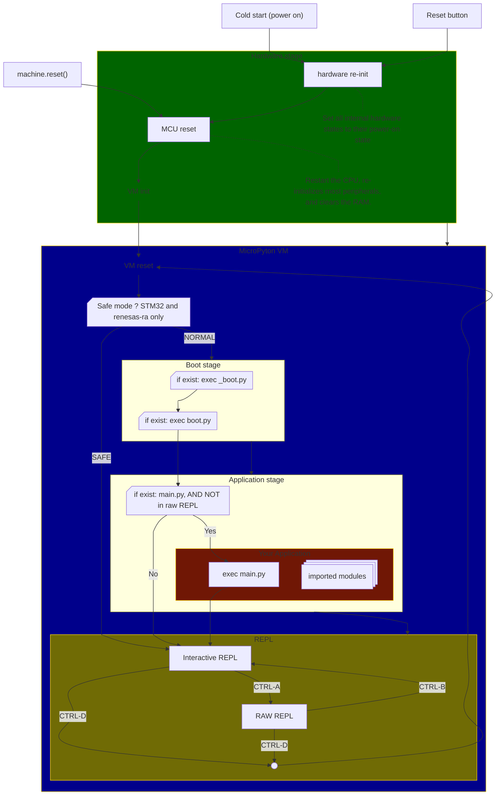

# MicroPython reset and boot flow

This diagram summarizes reset entry points and the startup sequence described in
the reset/boot reference.

## Notes

- Hard reset entry points include cold power-on, reset button, and
	`machine.reset()`.
- Soft reset entry points include `machine.soft_reset()` and `Ctrl-D` at REPL.
- `_boot.py` runs first (frozen in firmware), then `boot.py`, then `main.py`.
- If `main.py` is missing, or it exits, the REPL starts.
- A soft reset triggered from raw REPL mode skips `main.py` startup.
- Startup entry points on the filesystem are ``boot.py`` and ``main.py``.
- If a frozen module named ``main.py`` exists, it is run first and cannot be
    overridden by filesystem ``main.py`` or ``main.mpy``.
- For regular imports, frozen modules are usually overrideable by filesystem
    modules because filesystem paths are searched before ``.frozen`` by default
    ``sys.path`` order.
- ``boot.mpy``/``main.mpy`` on the filesystem are not auto-executed as startup
    entry points.
- To use ``.mpy`` at startup, import pre-compiled modules from ``boot.py`` or
    ``main.py``, or freeze modules named ``boot.py``/``main.py`` into firmware.

- Port-specific startup-script selection hooks:
    ``pyb.main(filename)`` is supported on stm32 and renesas-ra, and
    ``machine.main(filename)`` is supported on cc3200/WiPy. These are intended to
    be called from ``boot.py`` to choose which script is run in the main stage.

- Built-in safe-boot mode (skip ``boot.py``/``main.py``) is documented on:
    stm32/pyboard, renesas-ra, and wipy/cc3200.
    On esp32 and rp2, documentation describes factory reset/reflash recovery
    rather than a built-in safe-boot script-skip mode.

