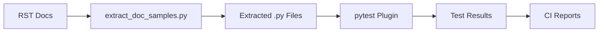

# MicroPython Documentation Code Sample Testing

This system extracts and tests Python code samples from the MicroPython documentation to ensure they remain valid and functional as the project evolves.

## Overview

The MicroPython documentation contains numerous code examples that demonstrate how to use various modules and features. This testing system:

1. **Extracts** code samples from RST documentation files
2. **Validates** syntax and imports using micropython-stubs  
3. **Tests** samples with configurable analysis levels
4. **Integrates** with CI/CD for continuous validation

## Quick Start

### 1. Setup

```bash
# Install dependencies and setup environment
pip install pytest pyyaml mypy astroid
git clone https://github.com/josverl/micropython-stubs.git micropython-stubs
cd micropython-stubs && pip install -e .
```

### 2. Extract Code Samples

```bash
# Extract all samples from documentation
python extract_doc_samples.py ../../docs --output organized_samples --stats

# Extract for specific platform
python extract_doc_samples.py ../../docs --output organized_samples --platform esp32 --stats

# Extract with syntax error fixes included
python extract_doc_samples.py ../../docs --output organized_samples --include-syntax-errors --stats
```

### 3. Test Samples

```bash
# Basic testing (syntax + imports)
cd organized_samples
python -m pytest -v --tb=short --disable-warnings

# Full testing (includes static analysis + execution)
cd organized_samples
python -m pytest -v --tb=short --run-static-analysis --run-execution-test

# Test specific platform
cd organized_samples
python -m pytest -v --platform-filter=esp32 --disable-warnings
```

### 4. View Statistics

```bash
# Analyze extracted sample structure
python analyze_structure.py --samples-dir organized_samples

# Show specific samples
python analyze_structure.py --show-sample "**/machine/*.py"
```

## Architecture

### Components

```
tools/doc_testing/
├── extract_doc_samples.py    # Main extraction tool
├── analyze_structure.py      # Sample structure analyzer
├── pytest_docsamples.py      # pytest plugin for testing
└── README.md                 # This file

.github/workflows/
└── test-doc-samples.yml      # CI/CD workflow

pyproject.toml                # Project configuration
```

### Data Flow



## Code Extraction

### Supported Patterns

The extractor recognizes these RST code block patterns:

1. **Double colon blocks** (most common):
   ```rst
   Usage Model::

       from machine import Pin
       pin = Pin(0, Pin.OUT)
   ```

2. **Standard code blocks**:
   ```rst
   .. code-block:: python

       import machine
       machine.freq()
   ```

3. **Interactive sessions**:
   ```rst
   >>> import network
   >>> wlan = network.WLAN()
   >>> wlan.active(True)
   True
   ```

### Platform Detection

The system automatically detects platform-specific samples based on:

- **File paths**: `docs/esp32/`, `docs/rp2/`, etc.
- **Content keywords**: "ESP32", "Pico", "PyBoard", etc.

Supported platforms:
- `esp32`, `esp8266`
- `rp2` (Raspberry Pi Pico)
- `pyboard`, `wipy`
- `unix`, `stm32`
- `samd`, `mimxrt`, `renesas-ra`, `zephyr`

### Sample Metadata

Each extracted sample includes:

```python
"""
Code sample extracted from: machine.Pin.rst:42
Sample ID: machine_Pin_a1b2c3d4
Context: Access the pin peripheral (GPIO pin) associated...
Dependencies: machine
Platform: esp32
Type: Code sample for MicroPython documentation
"""
```

## Testing Levels

### 1. Basic Testing (Default)

- **Syntax validation**: AST parsing
- **Import checking**: Verify dependencies exist in micropython-stubs
- **Static analysis**: Basic undefined variable detection

### 2. Extended Testing

- **Execution testing**: Attempt to run code with mocked hardware
- **Type checking**: MyPy analysis with stubs
- **Advanced static analysis**: More thorough code analysis

### 3. Manual Testing Options

```bash
# Test with strict import checking
cd extracted_samples
python -m pytest --strict-imports

# Test with execution attempts
python -m pytest --run-execution-test

# Test specific platform samples
python -m pytest --platform-filter=esp32
```

## CI/CD Integration

### GitHub Actions Workflow

The workflow runs on:
- **Push/PR** to `master/main` (when docs change)
- **Weekly schedule** (Mondays at 2 AM UTC)  
- **Manual trigger** with options

### Workflow Features

- **Multi-Python testing** (3.8, 3.9, 3.10, 3.11)
- **Platform filtering** support
- **Artifact uploads** (test results, extracted samples)
- **Automatic issue creation** on scheduled failures
- **Parallel type checking** job for performance

### Trigger Manually

```bash
# Via GitHub UI or gh CLI
gh workflow run test-doc-samples.yml \
  -f platform_filter=esp32 \
  -f run_full_analysis=true
```

## Usage Examples

### Extract Samples for ESP32

```bash
python extract_doc_samples.py ../../docs \
  --output esp32_samples \
  --platform esp32 \
  --stats
```

### Test with Custom Options

```bash
cd organized_samples
python -m pytest -v \
  --micropython-stubs-path=../micropython-stubs \
  --run-static-analysis \
  --platform-filter=rp2 \
  -k "pin or gpio"
```

### Generate Sample Report

```bash
# Extract as YAML for processing
python extract_doc_samples.py ../../docs \
  --output samples.yaml \
  --format yaml

# Or JSON
python extract_doc_samples.py ../../docs \
  --output samples.json \
  --format json
```

## Configuration

### pytest Configuration

In `pyproject.toml`:

```toml
[tool.pytest.ini_options]
testpaths = ["organized_samples"]
python_files = ["*sample*.py"]
addopts = ["--tb=short", "--disable-warnings"]
markers = [
    "slow: marks tests as slow",
    "platform_specific: marks tests as platform-specific", 
    "execution: marks tests that execute code samples",
]
```

### MyPy Configuration

```toml
[tool.mypy]
ignore_missing_imports = true
show_error_codes = true

# Ignore errors in organized samples
[[tool.mypy.overrides]]
module = "organized_samples.*"
ignore_errors = true
```

## Development

### Project Structure

```
tools/doc_testing/
├── extract_doc_samples.py     # Main extraction logic
├── analyze_structure.py       # Sample structure analyzer
├── pytest_docsamples.py       # pytest plugin
├── README.md                  # Documentation
├── requirements.txt           # Dependencies
└── tests/                     # Unit tests
    ├── test_extraction.py
    └── test_plugin.py
```

### Adding New Features

1. **New extraction patterns**: Modify `CODE_BLOCK_PATTERNS` in `extract_doc_samples.py`
2. **New test types**: Add methods to `DocSampleTest` class
3. **Platform support**: Update `PLATFORM_INDICATORS` dictionary
4. **CI improvements**: Modify `.github/workflows/test-doc-samples.yml`

### Running Tests

```bash
# Test the extraction tool itself
python -m pytest tools/doc_testing/tests/

# Test the full pipeline
python extract_doc_samples.py ../../docs --output test_samples --stats
cd test_samples
python -m pytest -v --tb=short --disable-warnings
```

## Troubleshooting

### Common Issues

**No samples extracted:**
```bash
# Check if docs path exists
ls ../../docs/

# Run with verbose output
python extract_doc_samples.py ../../docs --stats
```

**Import errors in tests:**
```bash
# Verify micropython-stubs setup
ls micropython-stubs/
pip show micropython-stubs

# Check PYTHONPATH
export PYTHONPATH="./micropython-stubs:$PYTHONPATH"
```

**Platform samples not found:**
```bash
# Check available platforms
python analyze_structure.py --samples-dir organized_samples

# Debug extraction for specific platform
python extract_doc_samples.py ../../docs --platform esp32 --stats
```

### Debugging Extraction

```bash
# Extract single file with debug info
python -c "
import sys
sys.path.append('.')
from extract_doc_samples import DocSampleExtractor
extractor = DocSampleExtractor()
extractor._process_file(Path('../../docs/library/machine.Pin.rst'))
print(f'Found {len(extractor.samples)} samples')
"
```

### Test Configuration

```bash
# Show pytest configuration
python -m pytest --collect-only

# Test specific sample with detailed output
cd organized_samples
python -m pytest -vvs library/machine/machine_0092_*.py
```

## Advanced Usage

### Custom Platform Detection

```python
# In extract_doc_samples.py
PLATFORM_INDICATORS = {
    'custom_board': ['custom', 'myboard'],
    # ... existing platforms
}
```

### Mock Hardware Modules

The pytest plugin includes mock objects for common MicroPython modules:

```python
# Extend mocks in pytest_docsamples.py
def _create_mock_modules(self):
    return {
        'machine': MockMachine(),
        'network': MockNetwork(), 
        'my_hardware': MockMyHardware(),  # Add custom
    }
```

### Integration with Other Tools

```bash
# Use with coverage
cd organized_samples
python -m pytest --cov=.

# Generate HTML reports
cd organized_samples
python -m pytest --html=report.html

# Export results to JUnit XML
cd organized_samples
python -m pytest --junitxml=results.xml
```

## Contributing

1. **Add tests** for new functionality
2. **Update documentation** for new features
3. **Run linting**: `python -m flake8 .`
4. **Test locally**: 
   ```bash
   python extract_doc_samples.py ../../docs --output test_samples --stats
   cd test_samples && python -m pytest -v
   ```
5. **Update CI** for new platforms/features

### Code Style

- **Black** for formatting: `python -m black .`
- **Flake8** for linting: `python -m flake8 .` 
- **MyPy** for type hints: `python -m mypy .`

## License

This project is part of MicroPython and follows the same MIT license.

## Related Projects

- [micropython-stubs](https://github.com/josverl/micropython-stubs) - Type stubs for MicroPython
- [MicroPython](https://micropython.org/) - Main project
- [pytest](https://pytest.org/) - Testing framework